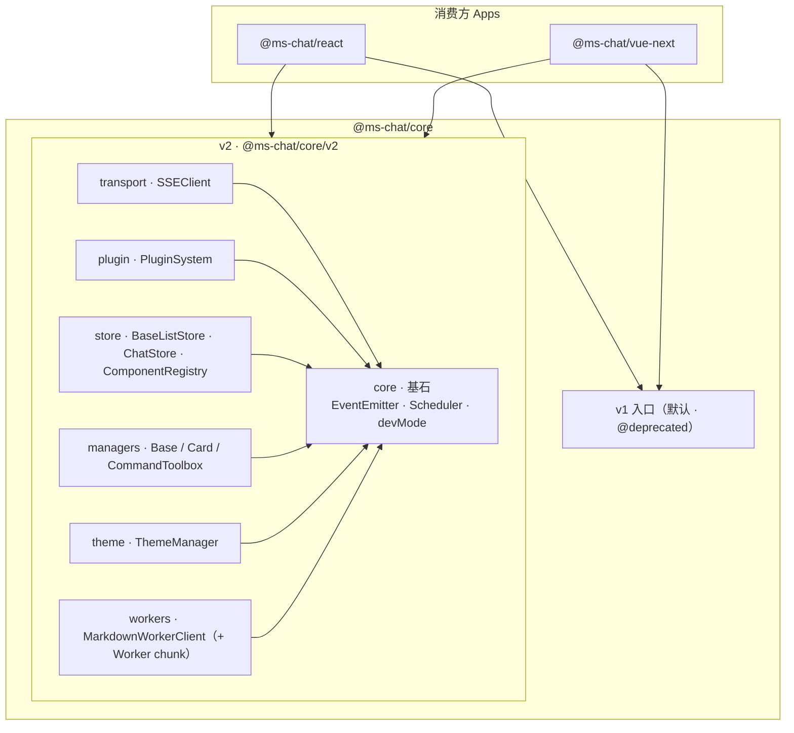
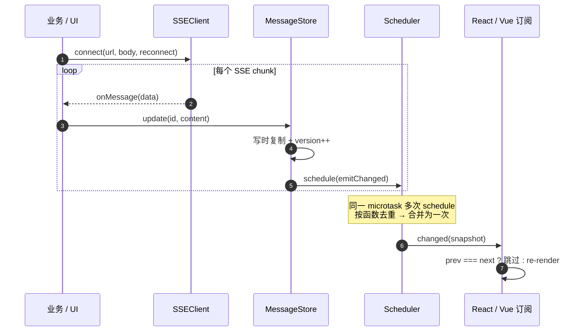
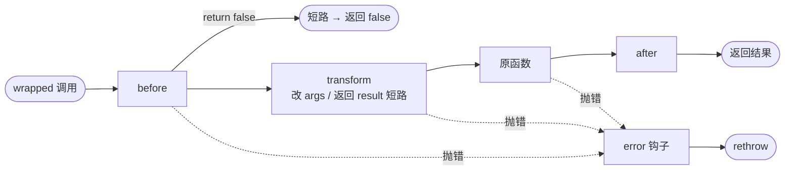
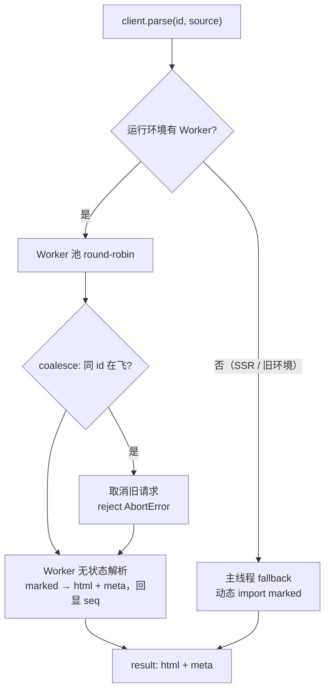

# MS-Chat

> 一个快速构建对话助手的前端组件库 —— 更像一套轻量、可组合的解决方案。
> React / Vue 双框架，公共逻辑沉淀在框架无关的 `@ms-chat/core`。

当前分支 `release-2.0.0` 承载 **v2 核心重构**：在不破坏 v1 的前提下，以子路径 `@ms-chat/core/v2` 双轨引入更健壮、可扩展、零运行时开销的新内核。重构方案见 [docs/refactor-rfc.md](docs/refactor-rfc.md)，迁移指南见 [docs/migration-v1-to-v2.md](docs/migration-v1-to-v2.md)。

## ✨ 特性

🧩 **单容器即用**：无需嵌套多层组件，一个容器覆盖全部场景，接入成本低
⚙️ **配置驱动**：交互、样式、文案均通过 JSON 配置完成，支持热更新
📡 **事件丰富**：统一 emits / 属性函数，轻松对接状态管理或业务逻辑
🌓 **插槽灵活**：关键节点提供同名插槽，既保留自由度又保持 API 简洁
🎉 **主题配置**：高度灵活的 JSON 化样式配置，支持柯里化样式调整
📦 每个组件可单独引入，Tree-Shaking 友好
🔧 完全 TypeScript，智能提示友好

### v2 内核增强（`@ms-chat/core/v2`）

🛡️ **错误隔离的 EventEmitter**：单个监听器抛错不再中断其余；`on/once` 返回 disposer
🔁 **可复用 SSEClient**：每次 connect 新建 AbortController，内建重连退避；修正 GET / 空 body 语义
🧩 **可卸载 PluginSystem**：`before / transform / after / error` 流水线，支持短路与热卸载
🪢 **引用稳定语义**：所有 getter / snapshot / emit payload 在状态不变时 `===` 相等，便于 React.memo / Vue shallowRef 短路
🧪 **devMode 校验层**：开发期契约校验，生产构建经 `__DEV__` 死代码消除，**零运行时开销**

## 📦 仓库结构

monorepo，子包位于 `packages/`：

| 包 | 说明 |
| --- | --- |
| `@ms-chat/core` | 框架无关的公共逻辑、类型定义。`v1`（默认入口）+ `v2`（子路径 `./v2`）双轨 |
| `@ms-chat/react` | React 基础组件 |
| `@ms-chat/vue-next` | Vue 3 基础组件 |

目标是 react / vue 尽量保持 API 一致，可复用内容尽量下沉到 core 复用。

## 🏛️ 架构总览

框架适配层（react / vue）保持薄，状态与逻辑下沉到框架无关的 `@ms-chat/core`。
core 内部 **v1 / v2 双轨**：v1 为默认入口并逐步 `@deprecated`，v2 经子路径 `@ms-chat/core/v2` 独立 tree-shaking。
v2 各能力模块统一构建在 `core`（EventEmitter / Scheduler / devMode）这块基石之上。



| v2 模块 | 子路径下导出 | 职责 |
| --- | --- | --- |
| `core` | `EventEmitter` · `Scheduler` · `setDevMode` | 错误隔离事件总线、microtask 批处理、dev 校验开关 |
| `transport` | `SSEClient` | 可复用 SSE 连接 + 重连退避 |
| `plugin` | `PluginSystem` · `createWrappedFunction` | before/transform/after/error 流水线 + 热卸载 |
| `store` | `MessageStore` · `ConversationStore` · `ConfigStore` · `MsgInputStore` · `ChatStore` · `ComponentRegistry` | 引用稳定状态层，实例级隔离 |
| `managers` | `CardConversationManager` · `CommandToolboxManager` | 含动画/定时器的有状态管理器（继承 `BaseStatefulManager`） |
| `theme` | `ThemeManager` | 深度递归 diff + 结构化共享，继承 EventEmitter |
| `workers` | `MarkdownWorkerClient` | Web Worker markdown 解析（池 / coalesce / SSR 降级） |

## 🚀 快速开始（@ms-chat/react）

1. 安装

```bash
npm i @ms-chat/react
```

2. 最小可运行示例（流式对话，v2 `SSEClient`）

```tsx
import { MSChat } from '@ms-chat/react';
import { SSEClient } from '@ms-chat/core/v2';
import { throttle } from 'lodash-es';

// pushMessage 保持 id 相同会触发消息「更新」而非新增
const pushMessage = (id: string, msg: string, isActive: boolean) =>
  msChatRef.current.pushMessage({
    id,
    type: 'markdown',
    content: msg,
    role: 'system',
    isStream: true,
    isActive,
  });

const sse = new SSEClient<{ choices: { delta: { content?: string } }[] }>();

const sendMsg = async (query: string) => {
  const id = crypto.randomUUID();
  let acc = '';
  const flush = throttle((active: boolean) => pushMessage(id, acc, active), 30);

  await sse.connect(
    {
      url: '你的/stream/chat',           // ← 换成真实端点
      method: 'POST',
      headers: { 'x-token': 'xxx' },     // ← 鉴权；也可传函数，每次 connect 重新求值
      body: { query, userId: 123 },
      reconnect: { enabled: true, backoff: [500, 1000, 2000], maxRetries: 3 },
    },
    {
      onMessage: (data) => {
        acc += data.choices?.[0]?.delta?.content ?? '';
        flush(true);
      },
      onClose: () => flush(false),
      onReconnect: (n) => console.warn('reconnecting', n),
    },
  );
  // ✅ 同一实例可复用：disconnect() 后可再次 connect()
};

const Main: React.FC<{ mode: 'h5' | 'pc' | 'bubble' }> = ({ mode }) => (
  <MSChat ref={msChatRef} mode={mode} onSendMsg={sendMsg} />
);
```

### 🎨 配置概览（`<MSChat>` props）

| props 名称 | 是否必填 | 说明 |
| --- | --- | --- |
| mode | 否 | 展示模式（PC / H5 / Bubble） |
| conversations | 否 | 历史会话列表 |
| conversationId | 否 | 当前选中的会话 id |
| messageList | 否 | 当前会话的历史消息列表 |
| chatConfig | 否 | Chat 内部各组件配置 |
| draggable | 否 | 是否开启可拖拽 |
| draggableOptions | 否 | 可拖拽的具体配置参数 |
| bubbleOptions | 否 | `mode=bubble` 时的按钮配置 |
| onSendMsg | 是 | 发送消息时调用 |
| onStopMsg | 是 | 停止消息时调用 |
| onUploadFiles | 是 | 上传文件时调用 |
| onSwitchConversation | 是 | 切换会话时调用 |
| onAddConversation | 是 | 新建会话时调用 |
| onDeleteConversation | 是 | 删除会话时调用 |
| onUpdateConversation | 是 | 更新会话时调用 |
| slots | 否 | 自定义展示位配置 |

### 常用二次开发入口

| 需求 | 改哪里 |
| --- | --- |
| 替换头像、名称 | `chatConfig.bubble.left / right` |
| 隐藏上传按钮 | `chatConfig.sender.options.enableUpload = false` |
| 自定义欢迎语 | `initWelcome()` 里把 `res.data` 换成你的静态 JSON |
| 新增 / 删除 / 重命名会话 | 内置 `onAddConversation / onDeleteConversation / onUpdateConversation` |
| 插入卡片 / 按钮 | `slots.bubbleCardExt = (props) => <YourCard {...props} />` |

Done！现在你已经拥有：✅ 会话列表 ✅ 流式对话 ✅ 文件上传 ✅ 多端模式（PC / H5 / 气泡）。

## 🧱 v2 Core API 速览

按需从子路径引入，与 v1 互不影响 tree-shaking：

```ts
import {
  EventEmitter,         // 类型化、错误隔离、可取消 once
  SSEClient,            // 可复用、重连退避
  PluginSystem,         // before/transform/after/error + 热卸载
  MessageStore,         // 引用稳定 snapshot + microtask 批处理
  ConversationStore,
  ChatStore,            // 组合各子 store + 实例级 ComponentRegistry
  ThemeManager,         // 深度递归 diff + 结构化共享，继承 EventEmitter
  Scheduler,            // microtask 批处理调度
  MarkdownWorkerClient, // Web Worker markdown 解析（池/coalesce/SSR fallback）
  CardConversationManager,
  CommandToolboxManager,
  setDevMode,           // 测试期切换 dev/prod 校验
} from '@ms-chat/core/v2';
```

详细 API 与从 v1 的迁移见 [docs/migration-v1-to-v2.md](docs/migration-v1-to-v2.md)。

## 🔄 核心数据流与机制

### 1）流式消息：批处理订阅

流式输出时每个 chunk 都会 `update` 消息，但细粒度事件（`message:add/update`）**同步**触发，
而广播给 UI 的 `changed` 走 `Scheduler` 的 **microtask 批处理**：一个同步突发里的多次变更
只派发一次 `changed`，订阅方据「引用稳定快照」用 `prev === next` 短路无谓 re-render。



### 2）插件流水线

`PluginSystem` 把目标函数包成 `before → transform → 原函数 → after` 的异步流水线；
任一阶段抛错跳到 `error` 钩子并 rethrow。`before` 返回 `false` 可短路，`transform` 可改写
下游 args 或直接返回 result 短路原函数。



### 3）MarkdownWorker：离主线程解析

`MarkdownWorkerClient` 把 markdown 解析放到 Web Worker，避免流式 re-parse 抢主线程帧。
无 Worker（SSR / 旧环境）时自动降级到主线程（动态 import 解析器，marked 不进主 bundle）。
Worker 无状态——coalesce / cancel 全靠 client 侧的 `seq` 关联。



### 贯穿设计原则

- **引用稳定语义**：所有 getter / snapshot / emit payload 在状态不变时返回 `===` 相等引用，
  内部写时复制 + 版本号；订阅方可放心用引用相等做 memo 短路（修旧版每帧全量拷贝）。
- **零开销 dev 校验**：dev 分支统一用 `if (IS_DEV && isDevMode() && ...)` 双层守卫——
  `IS_DEV` 是编译期常量供死代码消除，`isDevMode()` 供测试运行时切换；生产构建后
  v2 bundle 实测 0 个 `__DEV__` / `console.*` / `Object.freeze` 残留。

## 🔨 本地开发

- 运行环境：**Node 18+**，包管理器 **pnpm@8**（仓库为 pnpm workspace）。
- 安装依赖：

```bash
pnpm install
```

- 常用脚本：

```bash
pnpm -r run dev        # 各子包 watch 构建
pnpm build             # 构建全部子包（pnpm -r run build）

# @ms-chat/core 内：
pnpm --filter @ms-chat/core test           # vitest 一次性跑全部用例
pnpm --filter @ms-chat/core test:watch     # watch 模式
pnpm --filter @ms-chat/core test:coverage  # 覆盖率
pnpm --filter @ms-chat/core typecheck      # tsc 校验 src + tests
```

- 体验组件：进入 `packages/react` 或 `packages/vue-next`，查看 `demo/` 目录运行示例。
- 运行 **v2 验证 demo**（自包含，演示引用稳定订阅 + 流式批处理）：

```bash
# React v2 demo
pnpm --filter @ms-chat/react exec vite demo/v2 --config vite.dev.config.ts --port 5191
# Vue v2 demo
pnpm --filter @ms-chat/vue-next exec vite demo/v2 --config vite.config.ts --port 5192
```

> CI：每次 push / PR 自动跑 `@ms-chat/core` 的 typecheck（strict）+ test（覆盖率门槛）+ build，见 [.github/workflows/ci.yml](.github/workflows/ci.yml)。


## 📖 文档与路线图

- 重构 RFC：[docs/refactor-rfc.md](docs/refactor-rfc.md)
- v1 → v2 迁移指南：[docs/migration-v1-to-v2.md](docs/migration-v1-to-v2.md)

重构分阶段推进（双轨：v1 保留并 `@deprecated`，v2 子路径并存）：

| 阶段 | 内容 | 状态 |
| --- | --- | --- |
| P0 | 清洁（删裸 .js、修 build、修类型）+ vitest 基建 | ✅ |
| P1 | 健壮性：EventEmitter / SSEClient / PluginSystem + devMode | ✅ |
| P2 | 扩展性：引用稳定 Store 层 / ChatStore / ComponentRegistry / Manager | ✅ |
| P3 | 性能：Scheduler 批处理 / ThemeManager v2 / MarkdownWorker（Web Worker 解析） | ✅ |
| P4 | GA & 工程化：GitHub Actions CI / v2 覆盖率门槛 / React + Vue v2 demo | ✅ |

> 全程 167 单测、tsc strict 通过、CI 绿；PROD v2 bundle 0 个 `__DEV__` / `console.*` / `Object.freeze` 残留。

## 😄 开发群

企业微信：xxx
